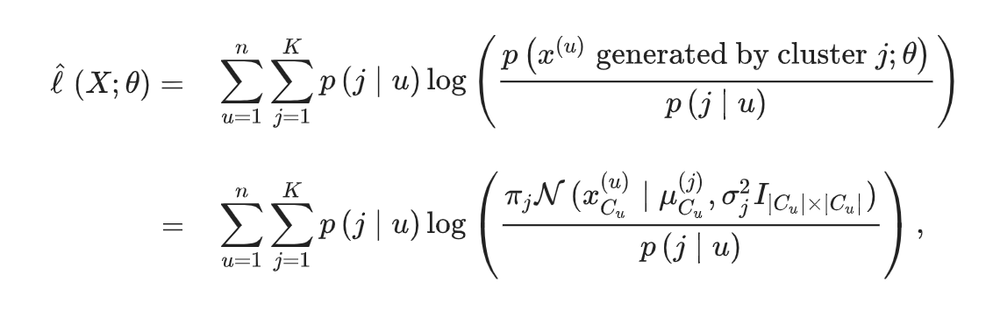
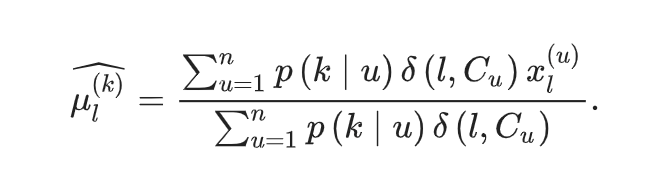
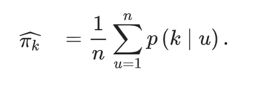

Movie Rating Prediction
================
Viacheslav Simonov
24/12/2021

# MovieLens Project

## Introduction

The main goal of this project is to create a movie recommendation system
which makes accurate predictions about a movie rating by certain users.

A chunk of code was provided to start with specific data. This data set,
named MovieLens, could be downloaded
[**here**](http://files.grouplens.org/datasets/movielens/ml-10m.zip).

Any machine learning method could be applied. In this project, several
effects or bias are calculated using the data provided and
cross-validation is used for the purpose of select the best parameter
which limits the penalization of small samples.

### Using the code provided

MovieLens data initially has 6 columns:

-   **userId**: ID of the user.  
-   **movieId**: ID of the movie.  
-   **rating**: rating of the movie by this user.  
-   **timestamp**: date where the rate was made.  
-   **title**: contains the title (and year) of the movie.  
-   **genre**: contains all the genres of the movie.

Data downloaded was split in two groups: *edx* as train set and
*validation* to test the algorithm. That data partition was made using
the *createDataPartition* function (filtering the data assuring that all
movies and users in *validation* data were also in the train set).

### Data dimensions:

Train set, *edx*, is approximately 90% of the original data. These are
the dimensions:

``` r
# Dimensions of edx (train set)
rows_edx <- nrow(edx)
col_edx <- ncol(edx)
```

*edx* data has 9000055 rows and 6 columns. And test set, *validation*,
is equivalent to the remaining 10%:

``` r
# Dimensions of validation (test set)
rows_validation <- nrow(validation)
col_validation <- ncol(validation)
```

*validation* data has 999999 rows and 6 columns.

This test set **only** will be used to calculate the accuracy of the
algorithm.

In order to achieve a general overview of the data, it could be shown
the number of unique movies rated and unique users:

``` r
validation %>% summarize(users = n_distinct(userId), movies = n_distinct(movieId))
```

    ##   users movies
    ## 1 68534   9809

This is the structure of the initial data:

``` r
head(edx)
```

    ##    userId movieId rating timestamp                         title
    ## 1:      1     122      5 838985046              Boomerang (1992)
    ## 2:      1     185      5 838983525               Net, The (1995)
    ## 3:      1     292      5 838983421               Outbreak (1995)
    ## 4:      1     316      5 838983392               Stargate (1994)
    ## 5:      1     329      5 838983392 Star Trek: Generations (1994)
    ## 6:      1     355      5 838984474       Flintstones, The (1994)
    ##                           genres
    ## 1:                Comedy|Romance
    ## 2:         Action|Crime|Thriller
    ## 3:  Action|Drama|Sci-Fi|Thriller
    ## 4:       Action|Adventure|Sci-Fi
    ## 5: Action|Adventure|Drama|Sci-Fi
    ## 6:       Children|Comedy|Fantasy

## Methods/analysis

Two approaches will be tried in order to achieve appropriate results.

### n-rank Funk matrix factorization

First approach is different-rank Funk matrix factorization, that is the
algorithm proposed by Simon Funk in his blog post factorized the
user-item rating matrix as the product of two lower dimensional
matrices, the first one has a row for each user, while the second has a
column for each item. In The row or column associated to a specific user
or item is referred to as latent factors. Note that, in Funk MF no
singular value decomposition is applied, it is a SVD-like machine
learning model.

The idea of the algorithm is to minimize the Objective function, in our
case RMSE, but we also should consider using of regularization parameter
Lambda, in order not to overtrain accordingly to the training dataset.

 The algorithm is
implemented as follows: 1. Randomly initialising all U and V(M in the
code) vectores except one of them. 2. Iteratively update every vector
with given values of other vectors by taking a derivative of LOSS
function with respect to the vector that we are trying to find. 3. The
predicted ratings can be computed as dot-product of corresponding user
and movie vectors.

**Data wrangling**

The IDs of users and movies are not arranged, so in order to make data
more comfortable to wrangle, I assigned all the movies and users
arranges number, in the way if we would like to build a matrix with
users as rows and movies as columns with ratings as values we could
easilydo it.

``` r
# 1. TRAINING DATA PARTITION
test_train_index <- createDataPartition(y = edx$rating, times = 1, p = 0.1, list = FALSE)

edx_train <- edx[-test_train_index,]
edx_validation <- edx[test_train_index,]


#
# 2. Assigning arranged numbers
# Idea is to set arranged numbers to users and movies
#
#
edx_train_with_numbers <- setArrangedNumberToUsersAndMovies(edx_train)

edx_validation_with_numbers <- applyUsersAndMoviesNumberFromOneDatasetToAnother(edx_train_with_numbers, edx_validation)

edx_with_numbers <- setArrangedNumberToUsersAndMovies(edx)

validation_with_numbers <- applyUsersAndMoviesNumberFromOneDatasetToAnother(edx_with_numbers, validation)

USERS_REG <- edx_train_with_numbers %>% group_by(userId) %>% summarise(n=n()) %>% nrow()
MOVIES_REG <- edx_train_with_numbers %>% group_by(movieId) %>% summarise(n=n()) %>% nrow()

USERS_TRAIN <- edx_with_numbers %>% group_by(userId) %>% summarise(n=n()) %>% nrow()
MOVIES_TRAIN <- edx_with_numbers %>% group_by(movieId) %>% summarise(n=n()) %>% nrow()
```

**Regularization**

In order to train the algorithm we need to define two parameters, matrix
rank and lambda. First we will define the best matrix rank manually with
fixed lambda, will run 30 epochs on training dataset and plot ranks
against RMSE and will choose the matrix rank after which the rmse
progress will not be significant(obviously the RMSE will drop as rank
will grow, but we have a trade-off for computation complexity here).

``` r
#
# 3. RUN REGULARIZATION TRAINING
#
epochs <- 30

ranks <- c(1,2,3,5,7,10)

FIXED_LAMBDA <- 2

matrix_reg_rmses <- numeric(length(ranks))

for (rank_idx in 1:length(ranks)) {
  matrix_rank = ranks[rank_idx]
  
  userFactMatrix <- initialiseUserFactorizationMatrix(nrow = USERS_REG, ncol = matrix_rank)
  movieFactMatrix <- initialiseMovieFactorizationMatrix(nrow = MOVIES_REG, ncol = matrix_rank)
  
  for (epoch in 1:epochs) {
    userFactMatrix <- updateUserFactorizationMatrix(edx_train_with_numbers, FIXED_LAMBDA, userFactMatrix, movieFactMatrix)
    movieFactMatrix <- updateMovieFactorizationMatrix(edx_train_with_numbers, FIXED_LAMBDA, userFactMatrix, movieFactMatrix)
  }
  
  # 3.1 COUNT RMSE FOR PARTICULAR MATRIX RANK AFTER 30 EPOCHS
  edx_validation_with_estimations <- getRankEstimations(edx_validation_with_numbers, userFactMatrix, movieFactMatrix)
  
  matrix_reg_rmses[rank_idx] <- RMSE(edx_validation_with_estimations$rating, edx_validation_with_estimations$rating_hat)
}

plot(ranks, matrix_reg_rmses)
```

<!-- -->

``` r
# Define best matrix rank after regularization
```

The progress after the 5-rank matrix is not significant, so we choose 5
as our matrix rank

``` r
# Define best matrix rank after regularization
BEST_RANK <- 5 
```

Now, after we will choose the best rank value, we will fix it and
regularize lambda, here we will just chose the best lambda by shown
performance on the training set.

``` r
lambdas <- c(1, 2, 3, 5)
lambda_reg_rmses <-numeric(length(lambdas))

for (lambda_idx in 1:length(lambdas)) {
  lambda = lambdas[lambda_idx]
  
  userFactMatrix <- initialiseUserFactorizationMatrix(nrow = USERS_REG, ncol = BEST_RANK)
  movieFactMatrix <- initialiseMovieFactorizationMatrix(nrow = MOVIES_REG, ncol = BEST_RANK)
  
  for (epoch in 1:epochs) {
    userFactMatrix <- updateUserFactorizationMatrix(edx_train_with_numbers, lambda, userFactMatrix, movieFactMatrix)
    movieFactMatrix <- updateMovieFactorizationMatrix(edx_train_with_numbers, lambda, userFactMatrix, movieFactMatrix)
  }
  
  # 3.1 COUNT RMSE FOR PARTICULAR LAMBDA
  edx_validation_with_estimations <- getRankEstimations(edx_validation_with_numbers, userFactMatrix, movieFactMatrix)
  
  lambda_reg_rmses[lambda_idx] <- RMSE(edx_validation_with_estimations$rating, edx_validation_with_estimations$rating_hat)
}

plot(lambdas, lambda_reg_rmses)
```

<!-- -->

``` r
# Define best lambda after regularization
BEST_LAMBDA <- lambdas[which.min(lambda_reg_rmses)] 
```

**Train algorithm**

Now, that we have both of our parameters, we can run our algorithm on
the whole training set and try to predict the ratings on the validation
set.

``` r
userFactMatrixTrain <- initialiseUserFactorizationMatrix(nrow = USERS_TRAIN, ncol = BEST_RANK)
movieFactMatrixTrain <- initialiseMovieFactorizationMatrix(nrow = MOVIES_TRAIN, ncol = BEST_RANK)

validation_epochs <- 70

for (epoch in 1:validation_epochs) {
  userFactMatrixTrain <- updateUserFactorizationMatrix(edx_with_numbers, BEST_LAMBDA, userFactMatrixTrain, movieFactMatrixTrain)
  movieFactMatrixTrain <- updateMovieFactorizationMatrix(edx_with_numbers, BEST_LAMBDA, userFactMatrixTrain, movieFactMatrixTrain)
}

#
# 6. VALIDATION
#
validation_with_estimations <- getRankEstimations(validation_with_numbers, userFactMatrixTrain, movieFactMatrixTrain)

validation_rmse <- RMSE(validation_with_estimations$rating, validation_with_estimations$rating_hat)
```

### EM algorithm with Gaussian mixtures

Second approach is Expectation-Maximization(EM) algorithm with Gaussian
mixtures that is often used for unsupervised soft clustering, and the
collaborative filter can be considered as such problem. The model
assumes that each user’s rating profile is a sample from a mixture
model. In other words, we have possible types of users and, in the
context of each user, we must sample a user type and then the rating
profile from the Gaussian distribution associated with the type.

The idea of the algorithms is to minimize objective log-likelihood
function that is defined as the likelihood(in log-domain) of all given
vectors(users) to defined mixture of K Gaussian distributions.



Where probability of point u generated by cluster j is defined as:


The algorithm is implemented as follows: 1. Randomly initialise the
mixture 2. E-step. Count posterior probabilities for all users generated
by all clusters and log-likelihood value 3. M-step. Redefine mus, sigmas
and probabilities through derivatives of log-likelihood function with
respect to each of them. 4. Iterate until convergence(small difference
between old likelihood and new likelihood)

 
 The EM algorithm proceeds by iteratively
assigning (softly) users to types (E-step) and subsequently
re-estimating the Gaussians associated with each type (M-step). Once we
have the mixture, we can use it to predict values for all the missing
entries in the data matrix. Finally not observed rating is etimated as
dot-product of vector of probabilities that user belongs to particular
cluster and the vector of estimated movie rating for this cluster.

**Data wrangling**

In order to manipulate data easily, and access it faster, I decide to
convert it to matrices(users as row, movies as columns, with ratings as
values) and write them to the file system to the quicker access after
ending the session.

``` r
# Sets rating to given matrix[user_number, movie_number]
set_rating_to_matrix <- function(data_row, dataset, matrix) {
  matrix[dataset[data_row]$user_number, dataset[data_row]$movie_number] <- dataset[data_row]$rating
}

set_zeros <- function(data_row, dataset, matrix) {
  matrix[dataset[data_row]$user_number, dataset[data_row]$movie_number] <- 0
}

# Converts raitings dataset to matrix with shape users:movies 
dataset_to_matrix <- function(dataset) {
  data_matrix <- big.matrix(nrow = max(dataset$user_number), ncol = max(dataset$movie_number), init = 0, type = 'float')

  lapply(1:nrow(dataset), set_rating_to_matrix, dataset = dataset, matrix = data_matrix)
  
  data_matrix
}

# Returns data file path depending on mode
get_file_path <- function(mode = TRAINING_MODE) {
  if (mode == TRAINING_MODE) {
    path <- 'generated_data/data_incomplete'
  } else {
    path <- 'generated_data/data_regul_incomplete'
  }
  
  path
}


# Returns data_matrix depending on mode
get_data_matrix <- function(mode = TRAINING_MODE) {
  file_path <- get_file_path(mode)
  
  if (file.exists(file_path)) {
    data_matrix <- read.big.matrix(file_path, type = 'float')
  } else {
    
    
    data_matrix <- dataset_to_matrix(edx_with_numbers)
    
    if (mode == REGULARIZATION_MODE) {
      data_matrix <- set_zeros_from_dataset_to_matrix(edx_validation_with_numbers, data_matrix)
    }
    write.big.matrix(data_matrix, file = file_path, row.names = F, col.names = F)
  }
  
  data_matrix
}

set_zeros_from_dataset_to_matrix <- function(dataset, matrix) {
  sapply(1:nrow(dataset), set_zeros, dataset, matrix)
  
  matrix
}

data_matrix <- get_data_matrix(TRAINING_MODE)
```

**Regularization**

For this approach we need to understand, what is the best aount of
clusters, and we will do it on the sample from the original set in order
to reduce the run time of the report and programm itself.

``` r
K <- seq(8,16,2)
likelihoods <- vector(mode = 'numeric', length(K))

EPSILON <- 10e-6

regul_matrix <- data_matrix[1:5000, 1:3000]

for (i in 1:length(K)) {
  clusters <- K[i]
  
  mixture <- init_mixture(regul_matrix, clusters)
  
  e_step_result <- e_step(regul_matrix, mixture)
  posteriors <- e_step_result[[1]]
  new_log_likelihood <- e_step_result[[2]]
  print(new_log_likelihood)
  
  mixture <- m_step(regul_matrix, mixture, posteriors)
  
  differ <- Inf
  
  while(differ >= abs(new_log_likelihood) * EPSILON) {
    old_log_likelihood <- new_log_likelihood
    
    e_step_result <- e_step(regul_matrix, mixture)
    posteriors <- e_step_result[[1]]
    new_log_likelihood <- e_step_result[[2]]
    print(new_log_likelihood)
    
    differ <- new_log_likelihood - old_log_likelihood
    
    if (differ <= abs(new_log_likelihood) * EPSILON) {
      break
    }
    
    mixture <- m_step(regul_matrix, mixture, posteriors)
  }
  likelihoods[i] <- new_log_likelihood
}
```

``` r
plot(K, likelihoods)
```

<!-- -->

``` r
BEST_K <- K[which.max(likelihoods)]
```

**Train algorithm**

``` r
mixture <- init_mixture(data_matrix, BEST_K)

e_step_result <- e_step(data_matrix, mixture)
posteriors <- e_step_result[[1]]
new_log_likelihood <- e_step_result[[2]]
print(new_log_likelihood)
```

``` r
mixture <- m_step(data_matrix, mixture, posteriors)

differ <- Inf

while(differ >= abs(new_log_likelihood) * EPSILON) {
  old_log_likelihood <- new_log_likelihood
  
  e_step_result <- e_step(data_matrix, mixture)
  posteriors <- e_step_result[[1]]
  new_log_likelihood <- e_step_result[[2]]
  print(new_log_likelihood)
  
  differ <- new_log_likelihood - old_log_likelihood
  
  if (differ <= abs(new_log_likelihood) * EPSILON) {
    break
  }
  
  mixture <- m_step(data_matrix, mixture, posteriors)
}
```

``` r
filled_matrix <- fill_matrix(data_matrix, mixture, posteriors)
```

``` r
rating_hats <- sapply(1:nrow(validation_with_numbers), function(row, validation_with_numbers, filled_matrix) {
  user_number <- validation_with_numbers[row]$user_number
  movie_number <- validation_with_numbers[row]$movie_number
  
  filled_matrix[user_number, movie_number]
}, validation_with_numbers, filled_matrix)

em_rmse <- RMSE(validation_with_numbers$rating, rating_hats)
```

## Results

**RMSE** for 5-rank Funk Matrix factorization is **0.8146935** that is
consodered as pretty good result.

**RMSE** for EM with Gaussian mixtures is **0.8757829** that is
significantly worse result in comparison with MF algorithm, that was
also easier to understand, implment and faster to run.

## Conclusion

Definetely, the MF factorization algorithm is very powerful for the
collaborative filtering problem and should be priorotised in comparison
with EM algorithm.

In order to improve the performnace for this problem even more, we could
consider reformulating the matrix factorization model as a neural
network model where we feed in one-hot vectors of the user and movie and
predict outcome for each pair.
