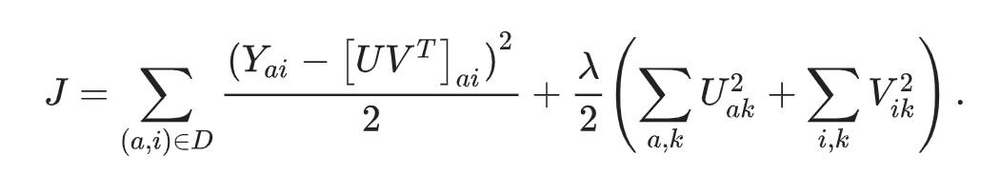
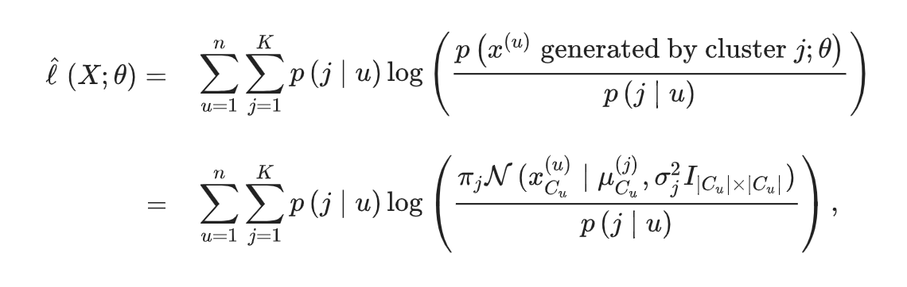
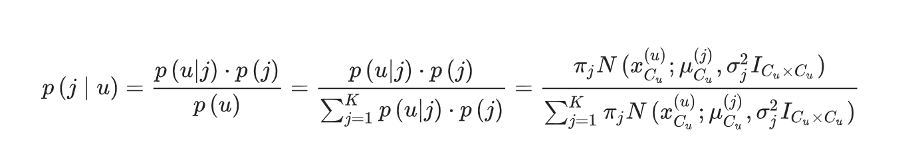
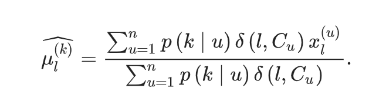
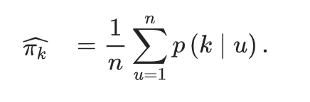
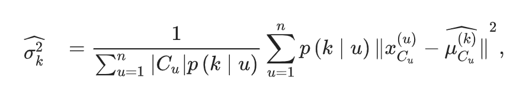

# MovieLens Project
## Introduction
The main goal of this project is to create a movie recommendation system which makes accurate predictions about a movie rating by certain users.

A chunk of code was provided to start with specific data. This data set, named MovieLens, could be downloaded [**here**](http://files.grouplens.org/datasets/movielens/ml-10m.zip).

Any machine learning method could be applied. In this project, several effects or bias are calculated using the data provided and cross-validation is used for the purpose of select the best parameter which limits the penalization of small samples.

### Using the code provided
MovieLens data initially has 6 columns:

* **userId**: ID of the user.  
* **movieId**: ID of the movie.  
* **rating**: rating of the movie by this user.  
* **timestamp**: date where the rate was made.  
* **title**: contains the title (and year) of the movie.  
* **genre**: contains all the genres of the movie.  

Data downloaded was split in two groups: _edx_ as train set and _validation_ to test the algorithm. That data partition was made using the _createDataPartition_ function (filtering the data assuring that all movies and users in _validation_ data were also in the train set).

```{r code provided, include=FALSE}
# Note: this process could take a couple of minutes

if(!require(tidyverse)) install.packages("tidyverse", repos = "http://cran.us.r-project.org")
if(!require(caret)) install.packages("caret", repos = "http://cran.us.r-project.org")
if(!require(data.table)) install.packages("data.table", repos = "http://cran.us.r-project.org")

library(tidyverse)
library(caret)
library(data.table)

# MovieLens 10M dataset:
# https://grouplens.org/datasets/movielens/10m/
# http://files.grouplens.org/datasets/movielens/ml-10m.zip

dl <- tempfile()
download.file("http://files.grouplens.org/datasets/movielens/ml-10m.zip", dl)

ratings <- fread(text = gsub("::", "\t", readLines(unzip(dl, "ml-10M100K/ratings.dat"))),
                 col.names = c("userId", "movieId", "rating", "timestamp"))

movies <- str_split_fixed(readLines(unzip(dl, "ml-10M100K/movies.dat")), "\\::", 3)
colnames(movies) <- c("movieId", "title", "genres")

movies <- as.data.frame(movies) %>% mutate(movieId = as.numeric(movieId),
                                           title = as.character(title),
                                           genres = as.character(genres))


movielens <- left_join(ratings, movies, by = "movieId")

# Validation set will be 10% of MovieLens data
set.seed(1, sample.kind="Rounding") # if using R 3.5 or earlier, use `set.seed(1)`
test_index <- createDataPartition(y = movielens$rating, times = 1, p = 0.1, list = FALSE)
edx <- movielens[-test_index,]
temp <- movielens[test_index,]

# Make sure userId and movieId in validation set are also in edx set
validation <- temp %>% 
  semi_join(edx, by = "movieId") %>%
  semi_join(edx, by = "userId")

# Add rows removed from validation set back into edx set
removed <- anti_join(temp, validation)
edx <- rbind(edx, removed)

rm(ratings, movies, test_index, temp, movielens, removed)

```

```{r helper functions, include=FALSE}
# Sets arranged numbers for users and movies from 1 to entity number
setArrangedNumberToUsersAndMovies <- function(dataset) {
  grouped_u_ids <- dataset %>% group_by(userId) %>% summarise(user_n=n())
  grouped_u_ids$user_number <- seq.int(nrow(grouped_u_ids))
  
  grouped_m_ids <- dataset %>% group_by(movieId) %>% summarise(movie_n=n())
  grouped_m_ids$movie_number <- seq.int(nrow(grouped_m_ids))
  
  dataset %>%
    left_join(grouped_u_ids, by="userId") %>%
    left_join(grouped_m_ids, by="movieId") %>%
    select(-user_n,-movie_n)
}

# Applies arranged number from one dataset to another
applyUsersAndMoviesNumberFromOneDatasetToAnother <- function(datasetWithNumbers, datasetWithoutNumbers) {
  train_user_ids_and_numbers <- datasetWithNumbers %>% select(userId, user_number)
  train_movie_ids_and_numbers <- datasetWithNumbers %>% select(movieId, movie_number)
  
  datasetWithoutNumbers %>%
    left_join(distinct(train_user_ids_and_numbers), by="userId") %>%
    left_join(distinct(train_movie_ids_and_numbers), by="movieId")
}

# Randomly initializes 1 vector for factorization matrix
# Depends on matrix rank
randomlyInitialiseFactorizationVector <- function(length, matrixRank = 2, maxRating = 5) {
  avgFactor <- maxRating ** (1/(matrixRank*2))
  
  sample(c(avgFactor - 0.1, avgFactor, avgFactor + 0.1), size = length, replace = T, prob = c(0.33,0.33,0.33))
}

# Initializes factorization matrix for users by given rows and columns number
initialiseUserFactorizationMatrix <- function(nrow, ncol = 2) {
  userFactorizationMatrix <- matrix(nrow = nrow, ncol = ncol)
  
  userFactorizationMatrix[,1] <- vector(mode = 'numeric', length = nrow)
  
  if (ncol > 1) {
    for (col in 2:ncol) {
      userFactorizationMatrix[,col] <- randomlyInitialiseFactorizationVector(length = nrow, matrixRank = ncol)
    }
  }
  
  userFactorizationMatrix
}


# Initializes factorization matrix for movies by given rows and columns number
initialiseMovieFactorizationMatrix <- function(nrow, ncol = 2) {
  movieFactorizationMatrix <- matrix(nrow = nrow, ncol = ncol)
  
  for (col in 1:ncol) {
    movieFactorizationMatrix[,col] <- randomlyInitialiseFactorizationVector(length = nrow, matrixRank = ncol)
  }
  
  movieFactorizationMatrix
}

allFactorsMultipliedExceptColumn <- function(matrix_1, matrix_2, row_1, row_2, col) {
  result <- 0
  for (column in 1:ncol(matrix_1)) {
    if (column != col) {
      result = result + matrix_1[row_1, column] * matrix_2[row_2, column]
    }
  }
  
  result
}

# Makes one epoch optimization for user factorization matrix
updateUserFactorizationMatrix <- function(dataset, lambda, userMatrix, movieMatrix) {
  for (col in 1:ncol(userMatrix)) {
    userMatrix[,col] <- dataset %>% 
      mutate(
        numerator = movieMatrix[movie_number,col] * (rating - allFactorsMultipliedExceptColumn(userMatrix, movieMatrix, user_number, movie_number, col)),
        denominator = movieMatrix[movie_number,col]**2
      ) %>%
      group_by(user_number) %>%
      summarise(new_u_col = sum(numerator)/(sum(denominator)+ lambda)) %>%
      arrange(user_number) %>%
      .$new_u_col
  }
  userMatrix
}

# Makes one epoch optimization for movie factorization matrix
updateMovieFactorizationMatrix <- function(dataset, lambda, userMatrix, movieMatrix) {
  for (col in 1:ncol(movieMatrix)) {
    movieMatrix[,col] <- dataset %>% 
      mutate(
        numerator = userMatrix[user_number,col] * (rating - allFactorsMultipliedExceptColumn(userMatrix, movieMatrix, user_number, movie_number, col)),
        denominator = userMatrix[user_number,col]**2
      ) %>%
      group_by(movie_number) %>%
      summarise(new_m_col = sum(numerator)/(sum(denominator)+ lambda)) %>%
      arrange(movie_number) %>%
      .$new_m_col
  }
  
  movieMatrix
}

# Counts rating estimation for given user and movie
getRatingHat <- function(user_number, movie_number, userMatrix, movieMatrix) {
  if (is.na(user_number)) {
    userVector <- colMeans(userMatrix)
  } else {
    userVector <- userMatrix[user_number,]
  }
  
  if (is.na(movie_number)) {
    movieVector <- colMeans(movieMatrix)
  } else {
    movieVector <- movieMatrix[movie_number,]
  }
  
  sum(userVector * movieVector)
}

# Returns dataset with estimations based on provided factorization matrices
getRankEstimations <- function(dataset, userMatrix, movieMatrix) {
  datasetWithEstimations <- dataset %>%
    mutate(rating_hat = map2(user_number, movie_number, getRatingHat, userMatrix, movieMatrix)) %>%
    unnest(rating_hat) %>%
    mutate(rating_hat = ifelse(rating_hat > 5, 5, rating_hat))
  
  datasetWithEstimations
}

# Function to check the results of ML
RMSE <- function(true_ratings, predicted_ratings){
  sqrt(mean((true_ratings - predicted_ratings)^2))
}
```
### Data dimensions:
Train set, _edx_, is approximately 90% of the original data. These are the dimensions:
```{r edx dimensions}
# Dimensions of edx (train set)
rows_edx <- nrow(edx)
col_edx <- ncol(edx)
```
_edx_ data has `r rows_edx` rows and `r col_edx` columns. And test set, _validation_, is equivalent to the remaining 10%:
```{r validation dimensions}
# Dimensions of validation (test set)
rows_validation <- nrow(validation)
col_validation <- ncol(validation)
```
_validation_ data has `r rows_validation` rows and `r col_validation` columns.

This test set **only** will be used to calculate the accuracy of the algorithm.

In order to achieve a general overview of the data, it could be shown the number of unique movies rated and unique users:
```{r unique}
validation %>% summarize(users = n_distinct(userId), movies = n_distinct(movieId))
```

This is the structure of the initial data:
```{r initial head}
head(edx)
```


## Methods/analysis

Two approaches will be tried in order to achieve appropriate results.

### n-rank Funk matrix factorization

First approach is different-rank Funk matrix factorization, that is the  algorithm proposed by Simon Funk in his blog post factorized the user-item rating matrix as the product of two lower dimensional matrices, the first one has a row for each user, while the second has a column for each item. In The row or column associated to a specific user or item is referred to as latent factors. Note that, in Funk MF no singular value decomposition is applied, it is a SVD-like machine learning model.

The idea of the algorithm is to minimize the Objective function, in our case RMSE, but we also should consider using of regularization parameter Lambda, in order not to overtrain accordingly to the training dataset.


The algorithm is implemented as follows:
1. Randomly initialising all U and V(M in the code) vectores except one of them.
2. Iteratively update every vector with given values of other vectors by taking a derivative of LOSS function with respect to the vector that we are trying to find.
3. The predicted ratings can be computed as dot-product of corresponding user and movie vectors.

**Data wrangling**

The IDs of users and movies are not arranged, so in order to make data more comfortable to wrangle, I assigned all the movies and users arranges number, in the way if we would like to build a matrix with users as rows and movies as columns with ratings as values we could easilydo it.

```{r MF data wrangling}
# 1. TRAINING DATA PARTITION
test_train_index <- createDataPartition(y = edx$rating, times = 1, p = 0.1, list = FALSE)

edx_train <- edx[-test_train_index,]
edx_validation <- edx[test_train_index,]


#
# 2. Assigning arranged numbers
# Idea is to set arranged numbers to users and movies
#
#
edx_train_with_numbers <- setArrangedNumberToUsersAndMovies(edx_train)

edx_validation_with_numbers <- applyUsersAndMoviesNumberFromOneDatasetToAnother(edx_train_with_numbers, edx_validation)

edx_with_numbers <- setArrangedNumberToUsersAndMovies(edx)

validation_with_numbers <- applyUsersAndMoviesNumberFromOneDatasetToAnother(edx_with_numbers, validation)

USERS_REG <- edx_train_with_numbers %>% group_by(userId) %>% summarise(n=n()) %>% nrow()
MOVIES_REG <- edx_train_with_numbers %>% group_by(movieId) %>% summarise(n=n()) %>% nrow()

USERS_TRAIN <- edx_with_numbers %>% group_by(userId) %>% summarise(n=n()) %>% nrow()
MOVIES_TRAIN <- edx_with_numbers %>% group_by(movieId) %>% summarise(n=n()) %>% nrow()
```

**Regularization**

In order to train the algorithm we need to define two parameters, matrix rank and lambda. First we will define the best matrix rank manually with fixed lambda, will run 30 epochs on training dataset and plot ranks against RMSE and will choose the matrix rank after which the rmse progress will not be significant(obviously the RMSE will drop as rank will grow, but we have a trade-off for computation complexity here). 

```{r matrix rank regularization}
#
# 3. RUN REGULARIZATION TRAINING
#
epochs <- 30

ranks <- c(1,2,3,5,7,10)

FIXED_LAMBDA <- 2

matrix_reg_rmses <- numeric(length(ranks))

for (rank_idx in 1:length(ranks)) {
  matrix_rank = ranks[rank_idx]
  
  userFactMatrix <- initialiseUserFactorizationMatrix(nrow = USERS_REG, ncol = matrix_rank)
  movieFactMatrix <- initialiseMovieFactorizationMatrix(nrow = MOVIES_REG, ncol = matrix_rank)
  
  for (epoch in 1:epochs) {
    userFactMatrix <- updateUserFactorizationMatrix(edx_train_with_numbers, FIXED_LAMBDA, userFactMatrix, movieFactMatrix)
    movieFactMatrix <- updateMovieFactorizationMatrix(edx_train_with_numbers, FIXED_LAMBDA, userFactMatrix, movieFactMatrix)
  }
  
  # 3.1 COUNT RMSE FOR PARTICULAR MATRIX RANK AFTER 30 EPOCHS
  edx_validation_with_estimations <- getRankEstimations(edx_validation_with_numbers, userFactMatrix, movieFactMatrix)
  
  matrix_reg_rmses[rank_idx] <- RMSE(edx_validation_with_estimations$rating, edx_validation_with_estimations$rating_hat)
}

plot(ranks, matrix_reg_rmses)
# Define best matrix rank after regularization
```
The progress after the 5-rank matrix is not significant, so we choose 5 as our matrix rank

```{r}
# Define best matrix rank after regularization
BEST_RANK <- 5 
```
Now, after we will choose the best rank value, we will fix it and regularize lambda, here we will just chose the best lambda by shown performance on the training set.

```{r lambda regularization}
lambdas <- c(1, 2, 3, 5)
lambda_reg_rmses <-numeric(length(lambdas))

for (lambda_idx in 1:length(lambdas)) {
  lambda = lambdas[lambda_idx]
  
  userFactMatrix <- initialiseUserFactorizationMatrix(nrow = USERS_REG, ncol = BEST_RANK)
  movieFactMatrix <- initialiseMovieFactorizationMatrix(nrow = MOVIES_REG, ncol = BEST_RANK)
  
  for (epoch in 1:epochs) {
    userFactMatrix <- updateUserFactorizationMatrix(edx_train_with_numbers, lambda, userFactMatrix, movieFactMatrix)
    movieFactMatrix <- updateMovieFactorizationMatrix(edx_train_with_numbers, lambda, userFactMatrix, movieFactMatrix)
  }
  
  # 3.1 COUNT RMSE FOR PARTICULAR LAMBDA
  edx_validation_with_estimations <- getRankEstimations(edx_validation_with_numbers, userFactMatrix, movieFactMatrix)
  
  lambda_reg_rmses[lambda_idx] <- RMSE(edx_validation_with_estimations$rating, edx_validation_with_estimations$rating_hat)
}

plot(lambdas, lambda_reg_rmses)

# Define best lambda after regularization
BEST_LAMBDA <- lambdas[which.min(lambda_reg_rmses)] 
```

**Train algorithm**

Now, that we have both of our parameters, we can run our algorithm on the whole training set and try to predict the ratings on the validation set.

```{r learning on the whole training set}
userFactMatrixTrain <- initialiseUserFactorizationMatrix(nrow = USERS_TRAIN, ncol = BEST_RANK)
movieFactMatrixTrain <- initialiseMovieFactorizationMatrix(nrow = MOVIES_TRAIN, ncol = BEST_RANK)

validation_epochs <- 70

for (epoch in 1:validation_epochs) {
  userFactMatrixTrain <- updateUserFactorizationMatrix(edx_with_numbers, BEST_LAMBDA, userFactMatrixTrain, movieFactMatrixTrain)
  movieFactMatrixTrain <- updateMovieFactorizationMatrix(edx_with_numbers, BEST_LAMBDA, userFactMatrixTrain, movieFactMatrixTrain)
}

#
# 6. VALIDATION
#
validation_with_estimations <- getRankEstimations(validation_with_numbers, userFactMatrixTrain, movieFactMatrixTrain)

validation_rmse <- RMSE(validation_with_estimations$rating, validation_with_estimations$rating_hat)
```


### EM algorithm with Gaussian mixtures

Second approach is Expectation-Maximization(EM) algorithm with Gaussian mixtures that is often used for unsupervised soft clustering, and the collaborative filter can be considered as such problem. The model assumes that each user's rating profile is a sample from a mixture model. In other words, we have  possible types of users and, in the context of each user, we must sample a user type and then the rating profile from the Gaussian distribution associated with the type.

The idea of the algorithms is to minimize objective log-likelihood function that is defined as the likelihood(in log-domain) of all given vectors(users) to defined mixture of K Gaussian distributions.



Where probability of point u generated by cluster j is defined as:



The algorithm is implemented as follows:
1. Randomly initialise the mixture
2. E-step. Count posterior probabilities for all users generated by all clusters and log-likelihood value
3. M-step. Redefine mus, sigmas and probabilities through derivatives of log-likelihood function with respect to each of them.
4. Iterate until convergence(small difference between old likelihood and new likelihood)




The EM algorithm proceeds by iteratively assigning (softly) users to types (E-step) and subsequently re-estimating the Gaussians associated with each type (M-step). Once we have the mixture, we can use it to predict values for all the missing entries in the data matrix. Finally not observed rating is etimated as dot-product of vector of probabilities that user belongs to particular cluster and the vector of estimated movie rating for this cluster.

```{r include=FALSE}
if(!require(bigmemory)) install.packages("bigmemory", repos = "http://cran.us.r-project.org")
if(!require(matrixStats)) install.packages("matrixStats", repos = "http://cran.us.r-project.org")

library(bigmemory)
library(matrixStats)

EXTRA_SMALL <- 1e-16

TRAINING_MODE <- 'training'
REGULARIZATION_MODE <- 'regularization'
# Initialise Gaussian mixture
# with given matrix of ratings and number of clusters
init_mixture <- function(user_movie_matrix, clusters) {
  user_amount <- nrow(user_movie_matrix)
  
  # Initial probabilities
  probs <- rep(1/clusters, clusters)
  
  mus <- user_movie_matrix[sample(1:user_amount, clusters, replace = F),]
  
  # Initial deviation
  vars <- sapply(1:clusters, function (cluster) {
    mean((sweep(user_movie_matrix[,], 2, mus[cluster,])) ** 2)
  })
  
  list(mus, vars, probs)
}

get_log_vector_norm_density <- function(vector, mus, var) {
   ((-norm(vector - mus, type = '2') ** 2) / (2 * var)) - (length(vector) / 2) * log(2 * pi * var)
}

prob_of_user_in_clusters <- function(user_ratings, mixture) {
  sapply(1:length(mixture[[2]]), function(cluster_i, user_ratings, mixture) {
    mus <- mixture[[1]]
    vars <- mixture[[2]]
    probs <- mixture[[3]]
    
    c_u <- which(user_ratings > 0)
    given_user_ratings <- user_ratings[c_u]
    mu_for_give_ratings_in_cluster <- mus[cluster_i,c_u]

    cluster_prob <- probs[cluster_i]
    log_norm_prob_of_user_in_cluster <- get_log_vector_norm_density(given_user_ratings, mu_for_give_ratings_in_cluster, vars[cluster_i])
    
    log(cluster_prob + EXTRA_SMALL) + log_norm_prob_of_user_in_cluster
  }, user_ratings, mixture)
}


# Counting posterior probabilities
# for each point to be related to each cluster
# and log_likelihood for current mixture
e_step <- function(user_movie_matrix, mixture) {
  user_amount <- nrow(user_movie_matrix)
  K <- length(mixture[[2]])
  
  log_user_probs <- sapply(1:user_amount, function(user_idx, user_movie_matrix, mixture) {
    prob_of_user_in_clusters(user_movie_matrix[user_idx,], mixture)
  }, user_movie_matrix, mixture)
  
  log_sum_all_clusters <- sapply(1:user_amount, function(user_idx, log_user_probs) {
    logSumExp(log_user_probs[,user_idx])
  }, log_user_probs)
  
  
  log_posteriors <- sweep(log_user_probs, 2, log_sum_all_clusters)
  
  log_likelihood <- sum(log_sum_all_clusters)
  
  list(exp(t(log_posteriors)), log_likelihood)
}

m_step <- function(user_movie_matrix, mixture, posteriors, min_variance = 0.25) {
  user_amount <- nrow(user_movie_matrix)
  movie_amount <- ncol(user_movie_matrix)
  clusters <- length(mixture[[2]])
  
  old_mus <- mixture[[1]]
  
  sum_posteriors_by_cluster <- colSums(posteriors)
  

  mus_hat <- t(sapply(1:clusters, function(cluster, mixture, posteriors, user_movie_matrix, old_mus) {
    user_probs_by_cluster <- posteriors[,cluster]
    
    sapply(1:movie_amount, function(movie_idx, user_movie_matrix, user_probs_by_cluster, old_mus, cluster) {
      denom <- sum(user_probs_by_cluster[which(user_movie_matrix[,movie_idx] != 0)])
      
      if (denom >= 1) {
        result <- sum(user_probs_by_cluster * user_movie_matrix[,movie_idx])/denom
      } else {
        result <- old_mus[cluster, movie_idx]
      }
      
      result
    }, user_movie_matrix, user_probs_by_cluster, old_mus, cluster)
  }, mixture, posteriors, user_movie_matrix, old_mus))
  
  user_given_ratings_amount <- rowSums(user_movie_matrix[,] != 0)
  
  vars_hat <- sapply(1:clusters, function(cluster, user_movie_matrix, user_given_ratings_amount, posteriors, mus_hat) {
    user_probs_by_cluster <- posteriors[,cluster]
    user_amount <- length(user_probs_by_cluster)
    
    denom <- sum(user_probs_by_cluster * user_given_ratings_amount)
    
    sum(sapply(1:user_amount, function(user_idx, user_movie_matrix, user_probs_by_cluster, cluster, mus_hat) {
      user_given_ratings_indexes <- which(user_movie_matrix[user_idx,] != 0)
      
      user_probs_by_cluster[user_idx] * norm(user_movie_matrix[user_idx, user_given_ratings_indexes] - mus_hat[cluster, user_given_ratings_indexes], type = '2') ** 2
    }, user_movie_matrix, user_probs_by_cluster, cluster, mus_hat))/denom
  }, user_movie_matrix, user_given_ratings_amount, posteriors, mus_hat)
  
  vars_hat[which(vars_hat < min_variance)] <- min_variance
  
  probs_hat <- sum_posteriors_by_cluster/user_amount
  
  list(mus_hat, vars_hat, probs_hat)
}

# Fills ratings for one user
fill_user_ratings <- function(user_ratings, mus, user_posteriors) {
  empty_ratings_indexes <- which(user_ratings == 0)
  
  mus_for_estimation <- mus[,empty_ratings_indexes]

  estimated_ratings <- rowSums(t(mus_for_estimation * user_posteriors))
  
  user_ratings[empty_ratings_indexes] <- estimated_ratings
  
  user_ratings
}


# Fill hole matrix with estimated ratings
fill_matrix <- function(user_movie_matrix, mixture, posteriors) {
  user_amount <- nrow(user_movie_matrix)
  
  mus <- mixture[[1]]
  
  filled_matrix <- sapply(1:user_amount, function(row, user_movie_matrix, mixture, posteriors) {
    print(row)
    fill_user_ratings(user_movie_matrix[row,], mus, posteriors[row,])
  }, user_movie_matrix, mixture, posteriors)
  
  t(filled_matrix)
}
```

**Data wrangling**

In order to manipulate data easily, and access it faster, I decide to convert it to matrices(users as row, movies as columns, with ratings as values) and write them to the file system to the quicker access after ending the session.

```{r data wrangling}
# Sets rating to given matrix[user_number, movie_number]
set_rating_to_matrix <- function(data_row, dataset, matrix) {
  matrix[dataset[data_row]$user_number, dataset[data_row]$movie_number] <- dataset[data_row]$rating
}

set_zeros <- function(data_row, dataset, matrix) {
  matrix[dataset[data_row]$user_number, dataset[data_row]$movie_number] <- 0
}

# Converts raitings dataset to matrix with shape users:movies 
dataset_to_matrix <- function(dataset) {
  data_matrix <- big.matrix(nrow = max(dataset$user_number), ncol = max(dataset$movie_number), init = 0, type = 'float')

  lapply(1:nrow(dataset), set_rating_to_matrix, dataset = dataset, matrix = data_matrix)
  
  data_matrix
}

# Returns data file path depending on mode
get_file_path <- function(mode = TRAINING_MODE) {
  if (mode == TRAINING_MODE) {
    path <- 'generated_data/data_incomplete'
  } else {
    path <- 'generated_data/data_regul_incomplete'
  }
  
  path
}


# Returns data_matrix depending on mode
get_data_matrix <- function(mode = TRAINING_MODE) {
  file_path <- get_file_path(mode)
  
  if (file.exists(file_path)) {
    data_matrix <- read.big.matrix(file_path, type = 'float')
  } else {
    
    
    data_matrix <- dataset_to_matrix(edx_with_numbers)
    
    if (mode == REGULARIZATION_MODE) {
      data_matrix <- set_zeros_from_dataset_to_matrix(edx_validation_with_numbers, data_matrix)
    }
    write.big.matrix(data_matrix, file = file_path, row.names = F, col.names = F)
  }
  
  data_matrix
}

set_zeros_from_dataset_to_matrix <- function(dataset, matrix) {
  sapply(1:nrow(dataset), set_zeros, dataset, matrix)
  
  matrix
}

data_matrix <- get_data_matrix(TRAINING_MODE)

```

**Regularization**

For this approach we need to understand, what is the best aount of clusters, and we will do it on the sample from the original set in order to reduce the run time of the report and programm itself.

```{r regularization}
K <- seq(8,16,2)
likelihoods <- vector(mode = 'numeric', length(K))

EPSILON <- 10e-6

regul_matrix <- data_matrix[1:5000, 1:3000]

for (i in 1:length(K)) {
  clusters <- K[i]
  
  mixture <- init_mixture(regul_matrix, clusters)
  
  e_step_result <- e_step(regul_matrix, mixture)
  posteriors <- e_step_result[[1]]
  new_log_likelihood <- e_step_result[[2]]
  print(new_log_likelihood)
  
  mixture <- m_step(regul_matrix, mixture, posteriors)
  
  differ <- Inf
  
  while(differ >= abs(new_log_likelihood) * EPSILON) {
    old_log_likelihood <- new_log_likelihood
    
    e_step_result <- e_step(regul_matrix, mixture)
    posteriors <- e_step_result[[1]]
    new_log_likelihood <- e_step_result[[2]]
    print(new_log_likelihood)
    
    differ <- new_log_likelihood - old_log_likelihood
    
    if (differ <= abs(new_log_likelihood) * EPSILON) {
      break
    }
    
    mixture <- m_step(regul_matrix, mixture, posteriors)
  }
  likelihoods[i] <- new_log_likelihood
}

plot(K, likelihoods)

BEST_K <- K[which.max(likelihoods)]
```

**Train algorithm**

```{r learning with best amount of clusters}
mixture <- init_mixture(data_matrix, BEST_K)

e_step_result <- e_step(data_matrix, mixture)
posteriors <- e_step_result[[1]]
new_log_likelihood <- e_step_result[[2]]
print(new_log_likelihood)

mixture <- m_step(data_matrix, mixture, posteriors)

differ <- Inf

while(differ >= abs(new_log_likelihood) * EPSILON) {
  old_log_likelihood <- new_log_likelihood
  
  e_step_result <- e_step(data_matrix, mixture)
  posteriors <- e_step_result[[1]]
  new_log_likelihood <- e_step_result[[2]]
  print(new_log_likelihood)
  
  differ <- new_log_likelihood - old_log_likelihood
  
  if (differ <= abs(new_log_likelihood) * EPSILON) {
    break
  }
  
  mixture <- m_step(data_matrix, mixture, posteriors)
}

filled_matrix <- fill_matrix(data_matrix, mixture, posteriors)

rating_hats <- sapply(1:nrow(validation_with_numbers), function(row, validation_with_numbers, filled_matrix) {
  user_number <- validation_with_numbers[row]$user_number
  movie_number <- validation_with_numbers[row]$movie_number
  
  filled_matrix[user_number, movie_number]
}, validation_with_numbers, filled_matrix)

em_rmse <- RMSE(validation_with_numbers$rating, rating_hats)
```


## Results
**RMSE** for 5-rank Funk Matrix factorization is **`r validation_rmse`** that is consodered as pretty good result.

**RMSE** for EM with Gaussian mixtures is **`r em_rmse`** that is significantly worse result in comparison with MF algorithm, that was also easier to understand, implment and faster to run.


## Conclusion
Definetely, the MF factorization algorithm is very powerful for the collaborative filtering problem and should be priorotised in comparison with EM algorithm.

In order to improve the performnace for this problem even more, we could consider reformulating the matrix factorization model as a neural network model where we feed in one-hot vectors of the user and movie and predict outcome for each pair.
